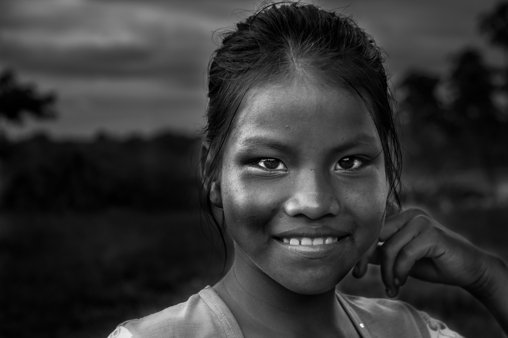
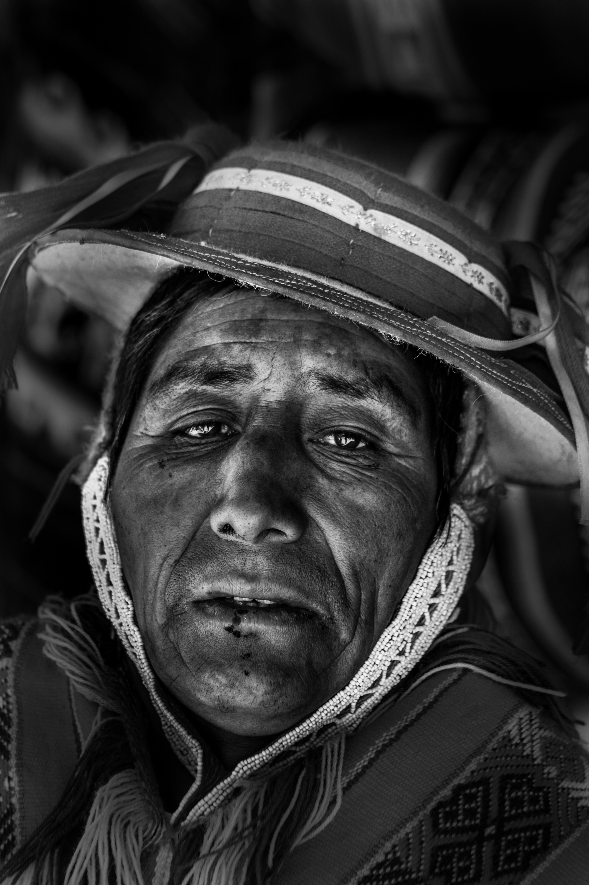

## Hi there 👋

I'm a physician by training, currently applying to Neurology residency. My research focuses on the intersection of visual field testing, neuro-ophthalmology and glaucoma.  

I'm a Master's student at Harvard University, where I'm concentrating in Clinical Investigation & Clinical Trials.
I'm completing my thesis under the supervision of David Friedman, at the [Friedman Lab](https://advances.massgeneral.org/ophthalmology/video.aspx?id=1176) at Mass Eye and Ear/MGB, where we are looking at [novel modalities of screening for glaucoma](https://clinicaltrials.gov/study/NCT06882356) 

I aspire to become a clinician-researcher. See more of our publications on my [Google Scholar](https://scholar.google.com/citations?user=b3BRcFsAAAAJ&hl=en&inst=7575085548378563675).

Outside of medicine, I'm an [amateur photographer](https://github.com/andresinzunza/Photography?tab=readme-ov-file#readme) (see below) and love making espresso, playing tennis or visiting a Boston museum with my wife.

•[Google Scholar](https://scholar.google.com/citations?user=b3BRcFsAAAAJ&hl=en&inst=7575085548378563675)

•[X](https://x.com/andresinzunzamd)

•[LinkedIn](www.linkedin.com/in/andresinzunza)

•[Photo repository](https://github.com/andresinzunza/Photography?tab=readme-ov-file#readme)

