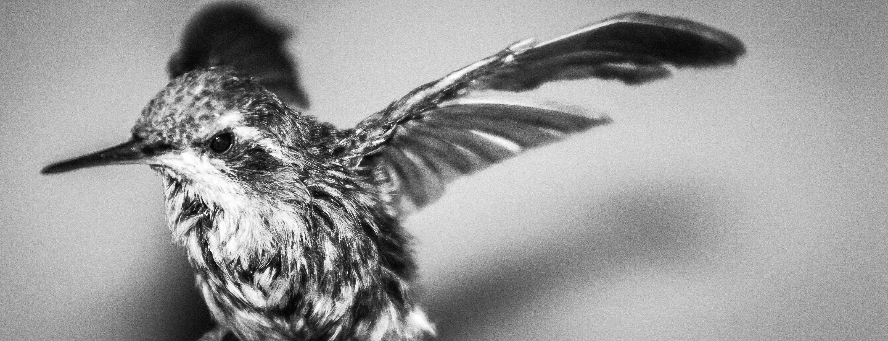
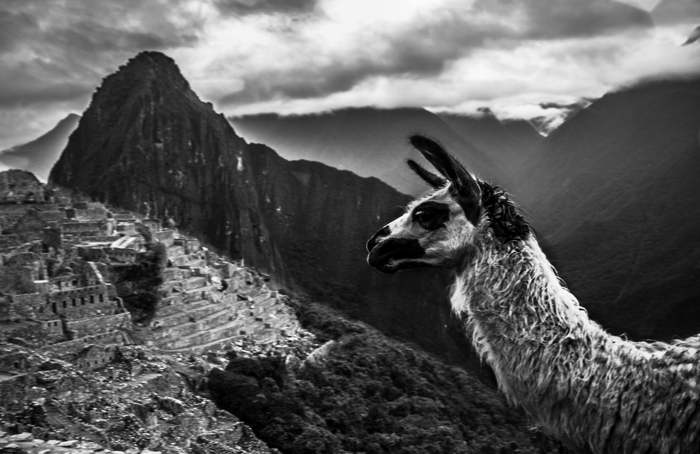
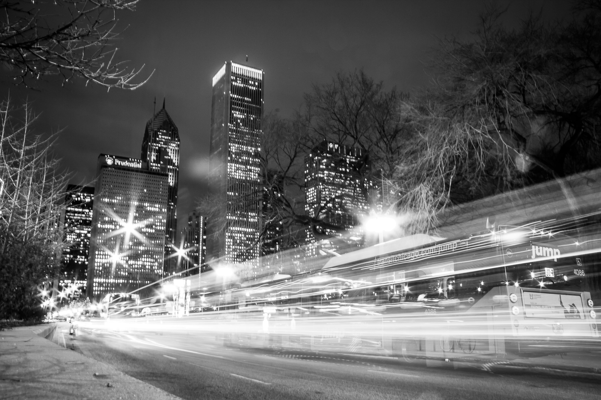

## Hi there 👋

I’m a physician, currently applying to Neurology residency, with research interests in visual field testing, neuro-ophthalmology and glaucoma.

I am a Master’s student at Harvard University, concentrating in Clinical Investigation & Clinical Trials. I am completing my thesis under the supervision of David Friedman at the [Friedman Lab](https://advances.massgeneral.org/ophthalmology/video.aspx?id=1176) (Mass Eye and Ear / Mass General Brigham), where our work focuses on [novel modalities for glaucoma screening](https://clinicaltrials.gov/study/NCT06882356).

I aspire to become a clinician-researcher. A list of my publications is available on [Google Scholar](https://scholar.google.com/citations?user=b3BRcFsAAAAJ&hl=en&inst=7575085548378563675).

Outside of medicine, I am an [amateur B&W photographer](https://andresinzunza.github.io/Photography/) (see below). I also enjoy making espresso, playing tennis, and visiting Boston museums with my wife.

### Connect
- 🎓 [Google Scholar](https://scholar.google.com/citations?user=b3BRcFsAAAAJ&hl=en&inst=7575085548378563675)  
- 🐦 [X (Twitter)](https://x.com/andresinzunzamd)  
- 💼 [LinkedIn](https://linkedin.com/in/andresinzunza)  
- 📷 [Photography Repository](https://andresinzunza.github.io/Photography/)

---

