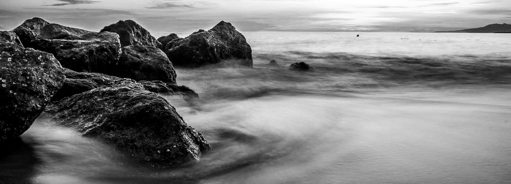

  
  

---
<h2 align="center"> 👋 ¡Hola! </h2>

---
I’m a physician currently applying to **Neurology residency**, with research interests in **visual field testing**, **neuro-ophthalmology**, and **glaucoma**.

I'm a student at **Harvard University** where I'm completing the Master's in Clinical Investigation. I'm doing thesis work under the direction of **David Friedman**, at the [Friedman Lab](https://advances.massgeneral.org/ophthalmology/video.aspx?id=1176) (Mass Eye and Ear / Mass General Brigham). Our work focuses on [novel modalities for glaucoma screening](https://clinicaltrials.gov/study/NCT06882356).

I aspire to become a **clinician–researcher**. Here is a link to my [CV](https://harvard.academia.edu/AndresInzunza/CurriculumVitae) and a [list of my publications](https://scholar.google.com/citations?user=b3BRcFsAAAAJ&hl=en&inst=7575085548378563675).

Outside of medicine, I'm an [amateur B&W photographer](https://andresinzunza.github.io/Photography/) (see below).  
I also enjoy making espresso, playing tennis, and visiting Boston museums with my wife.

---

### Connect

  🎓 <a href="https://scholar.google.com/citations?user=b3BRcFsAAAAJ&hl=en&inst=7575085548378563675">Google Scholar</a> ·
  🐦 <a href="https://x.com/andresinzunzamd">X (Twitter)</a> ·
  💼 <a href="https://linkedin.com/in/andresinzunza">LinkedIn</a> ·
  📷 <a href="https://andresinzunza.github.io/Photography/">Photography</a>

---

  
  
  
  

